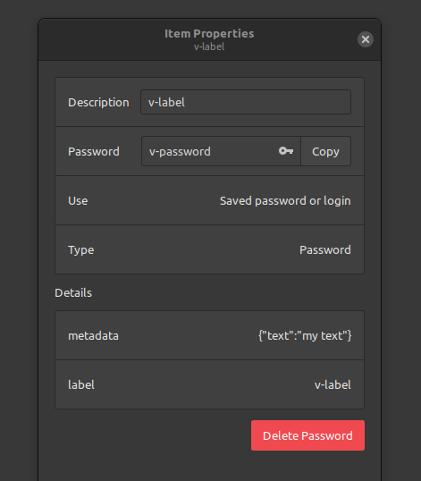

# libsecret.v

Minimal implementation of libsecret (Secret Service API) for managing secrets in Vlang.
The examples from the [C docs](https://gnome.pages.gitlab.gnome.org/libsecret/libsecret-c-examples.html#remove-a-password) are implemented.

## Installation

This library uses the `libsecret/secret.h` C-headers.
The following dependencies are required:
- `libsecret-1-0`
- `libsecret-1-dev`

On Debian-based distro's, these can be installed via:
```bash
sudo apt install -y libsecret-1-0 libsecret-1-dev
```

Note: `libsecret` expects this to be exected on a GUI-system. 
If you try to run this on a headless server, you may get an error like `Cannot autolaunch D-Bus without X11 $DISPLAY`.

```bash
v install robinvandernoord.libsecret
```

## Usage
```v
import robinvandernoord.libsecret

// initial setup:
struct Metadata {
    // you can store anything you like here!
    // It will be converted to JSON.

    text string
}

schema := libsecret.get_schema()

// save a password:
schema.store_password("Label Description", "my-password", Metadata {"text string"})

// load password with metadata:
mut metadata := Metadata {} // start with an empty object to fill

password := schema.load_password("Label Description", mut metadata)

println(password or {"missing password"}) // -> "my-password"
println(metadata) // Metadata { text: "text string" }

// remove password:
assert schema.remove_password("Label Description")
```


